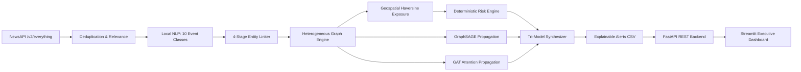

# BDS-35: News-to-Risk Supply-Chain Early Warning with Event & Graph-Based Risk Propagation

[]()
[]()
[]()
[]()
[]()
[]()

BDS-35 is a complete, offline-capable, real-time supply chain early-warning system. It transforms unstructured global news broadcasts into structured disruption events, resolves affected entities against master supply chain data, projects shocks across a multi-relational supply chain graph, and computes explainable multi-tier risk scores using deterministic heuristics and Graph Neural Networks (GraphSAGE and Graph Attention Networks).

---

## Table of Contents
1. [Project Overview](#1-project-overview)
2. [Architecture](#2-architecture)
3. [Dataset Explanation](#3-dataset-explanation)
4. [Synthetic vs. Real Data Distinction](#4-synthetic-vs-real-data-distinction)
5. [Installation](#5-installation)
6. [Environment Setup](#6-environment-setup)
7. [NewsAPI Setup](#7-newsapi-setup)
8. [Backend Run Command](#8-backend-run-command)
9. [Dashboard Run Command](#9-dashboard-run-command)
10. [Testing](#10-testing)
11. [GNN Training](#11-gnn-training)
12. [GNN Inference](#12-gnn-inference)
13. [Limitations](#13-limitations)
14. [Future Work](#14-future-work)

---

## 1. Project Overview

Supply chain disruptions—such as maritime canal blockages, port labor walkouts, industrial plant fires, and raw material shortages—frequently trigger cascading delays across multi-tier supplier networks. Enterprise resource planning (ERP) systems typically operate on historical batch data and fail to detect emerging risks reported in global news media.

**BDS-35 solves this challenge by delivering:**
- **Zero Cloud LLM Dependency**: 100% local, deterministic NLP extraction (10 event classes) without OpenAI or Gemini dependencies.
- **Strict Entity Resolution**: A 4-stage cascade (Exact $\to$ Normalized $\to$ Alias $\to$ Controlled Fuzzy) with strict `UNKNOWN` fallbacks.
- **Heterogeneous Graph Propagation**: NetworkX multi-directed graphs and PyTorch Geometric `HeteroData` (6 node types, 7 edge types).
- **Explainable Tri-Model Risk Synthesis**: Combining deterministic heuristic factors with GraphSAGE and GAT topological shock diffusion.
- **Production Interfaces**: High-throughput FastAPI REST backend and an interactive 12-page Streamlit executive dashboard.

---

## 2. Architecture



Detailed architectural blueprints and sequence diagrams are documented in [`docs/architecture.md`](docs/architecture.md).

---

## 3. Dataset Explanation

BDS-35 organizes 33,500 records across 12 relational CSV files with strict primary and foreign key referential integrity:

| Directory | File | Records | Role / Contents |
| :--- | :--- | :---: | :--- |
| `data/master/` | `suppliers.csv` | 1,000 | Tier 1-3 suppliers, countries, criticality, financial stability |
| `data/master/` | `products.csv` | 1,000 | Components, assemblies, lead times, criticality scores |
| `data/master/` | `locations.csv` | 1,000 | Cities, ports, airports, logistics hubs, WGS84 coordinates |
| `data/master/` | `facilities.csv` | 1,000 | Physical supplier manufacturing and warehousing sites |
| `data/master/` | `supplier_products.csv` | 3,000 | Bill-of-materials sourcing shares and single-source flags |
| `data/master/` | `supplier_locations.csv` | 3,000 | Operational geographic footprints of suppliers |
| `data/graph/` | `nodes.csv` | 3,000+ | Heterogeneous graph entities (6 node types) |
| `data/graph/` | `edges.csv` | 10,000 | Directed multi-relational edges (7 edge types) |
| `data/processed/` | `news.csv` / `live_news.csv` | 1,000+ | Ingested and normalized news articles with relevance |
| `data/processed/` | `events.csv` | 1,000+ | NLP-extracted disruption events with severities |
| `data/processed/` | `news_entities.csv` | 8,000+ | Extracted mention spans and linking confidence scores |
| `data/processed/` | `alerts.csv` | 50+ | Multi-model risk alerts, risk bands, and explanations |

Complete schemas, data types, and constraints are cataloged in [`docs/data_dictionary.md`](docs/data_dictionary.md).

---

## 4. Synthetic vs. Real Data Distinction

To maintain scientific integrity and prevent hallucinated supplier intelligence:
- **Master Data (`data/master/`)**: All suppliers, products, and supply chain topologies are **synthetically generated demo records** designed to mirror real-world industrial networks without disclosing confidential corporate NDA data. All rows carry `provenance: "SYNTHETIC_DEMO"`.
- **Live News Data (`data/processed/live_news.csv`)**: Articles ingested from NewsAPI represent **real-world live news broadcasts** and carry `provenance: "REAL_DATA"`.
- **UI Labeling**: Whenever synthetic supplier records are rendered in the Streamlit dashboard, a prominent **`DEMO DATA`** badge is displayed. Synthetic demo records are **never** represented as real.

See [`docs/academic_integrity.md`](docs/academic_integrity.md) for our full ethical disclosure.

---

## 5. Installation

BDS-35 is designed and verified to run on Windows, Linux, and macOS using standard Python virtual environments.

### Windows (PowerShell) Setup:
```powershell
# 1. Clone repository and navigate to workspace
cd c:\BDS35_News_to_Risk

# 2. Create Python virtual environment
python -m venv .venv

# 3. Activate virtual environment
.venv\Scripts\Activate.ps1

# 4. Install pinned dependencies
pip install -r requirements.txt
```

---

## 6. Environment Setup

Create your local runtime environment configuration file from `.env.example`:

```powershell
Copy-Item .env.example .env
```

Verify your `.env` configuration:
```ini
# Add your NewsAPI key from https://newsapi.org/register
NEWSAPI_API_KEY=your_key_here

LIVE_NEWS_TOPIC=supply chain disruptions ports logistics manufacturing trade
LIVE_NEWS_PROVIDER=newsapi
LIVE_NEWS_HOURS=48
LIVE_NEWS_LIMIT=8
DATABASE_URL=sqlite:///./bds35.db
```

---

## 7. NewsAPI Setup

1. Register for a free or developer API key at [NewsAPI.org](https://newsapi.org/register).
2. Insert your key into `.env`:
   ```ini
   NEWSAPI_API_KEY=4932a409f9914fb28eab9c964c527a27
   ```
3. If no key is configured or offline development is needed, the ingestion engine automatically falls back to static replay mode using `data/processed/news.csv` without throwing exceptions.

---

## 8. Backend Run Command

Start the FastAPI REST backend server with hot reloading enabled:

```powershell
python -m uvicorn src.api.main:app --reload --port 8000
```

- **Health Check**: `http://127.0.0.1:8000/health`
- **Interactive Swagger UI**: `http://127.0.0.1:8000/docs`
- **OpenAPI Schema**: `http://127.0.0.1:8000/openapi.json`

Full API endpoints and payload schemas are documented in [`docs/api_documentation.md`](docs/api_documentation.md).

---

## 9. Dashboard Run Command

Launch the multi-page Streamlit executive dashboard in a separate terminal:

```powershell
streamlit run dashboard/app.py
```

The browser will open automatically at `http://localhost:8501`.
Features include:
- Interactive Plotly multi-hop supply chain graphs.
- Real-time NewsAPI polling and live pipeline execution controls.
- Early warning alert triage with risk band filters (`LOW`, `MEDIUM`, `HIGH`, `CRITICAL`).
- Model comparison views (Deterministic vs. GraphSAGE vs. GAT).
- Analyst feedback logging and data quality monitoring.

---

## 10. Testing

Run the automated test suite across all 17 test modules:

```powershell
pytest -q
```
**Expected Output**: `128 passed in ~26s (100% green)`

To verify syntax and byte-compilation across all project files:
```powershell
python -m compileall .
```
**Expected Output**: `Exit code 0 (0 compilation errors)`

Full verification metrics are documented in [`docs/testing_report.md`](docs/testing_report.md).

---

## 11. GNN Training

Both GraphSAGE and GAT models can be re-trained from scratch using deterministic seeds:

### Train GraphSAGE (Phase 8):
```powershell
python -m src.gnn.trainer --model graphsage --epochs 100 --lr 0.01 --seed 42
```
*Saves checkpoint to `models/graphsage_phase8.pt`.*

### Train Graph Attention Network (Phase 9):
```powershell
python -m src.gnn.trainer_gat --epochs 100 --lr 0.005 --heads 2 --seed 42
```
*Saves checkpoint to `models/gat_phase9.pt`.*

See [`docs/gnn_methodology.md`](docs/gnn_methodology.md) for architectural details and Dirichlet loss formulation.

---

## 12. GNN Inference

To execute live model inference and score the supply chain graph dynamically:

```powershell
python -c "from src.gnn.inference import score_graph; s = score_graph(model_type='both'); print('Graph scored successfully. Suppliers evaluated:', len(s))"
```

Inference outputs are strictly bounded in $[0.0, 1.0]$ and feed into the tri-model synthesis formula:
$$\text{Combined Risk} = 0.50 \cdot \text{Deterministic} + 0.25 \cdot \text{GraphSAGE} + 0.25 \cdot \text{GAT}$$

---

## 13. Limitations

1. **Heuristic Calibration**: Risk bands (`LOW`, `MEDIUM`, `HIGH`, `CRITICAL`) are project-defined operational thresholds. They reflect relative prioritization rather than empirical probabilities of business failure.
2. **Attention Non-Causality**: GAT attention coefficients reflect localized feature aggregation importance within a mathematical neural network. **Attention weights do NOT prove or establish real-world causal relationships.**
3. **Geospatial Proximity vs. Real Disruption**: Being within 25 km of a port strike increases risk exposure, but suppliers with dual logistics routes or high buffer inventory may experience zero production downtime.
4. **News Coverage Bias**: Emerging disruptions in developing nations or non-English speaking logistics corridors may suffer from reporting latency or under-representation in commercial news APIs.

---

## 14. Future Work

1. **Multilingual NLP Extraction**: Extend the local extraction engine to parse local Mandarin, Japanese, German, and Spanish industrial trade bulletins.
2. **Temporal Dynamic Graphs (T-GNN)**: Incorporate temporal edge events with discrete timestamps to model time-decaying disruption shocks dynamically over time.
3. **Enterprise ERP Ingestion Connectors**: Develop native SAP, Oracle NetSuite, and Coupa API connectors to synchronize real-world purchase orders, shipment tracking, and tier-N bills of materials automatically.
4. **Supply Chain Digital Twin Simulation**: Implement discrete-event simulation (DES) to simulate alternate shipping rerouting scenarios when high-risk alerts fire.

---

## License & Citation
Developed under academic research standards for early warning supply chain risk intelligence. All reference citations and methodology guides are available in the [`docs/`](docs/) directory.
