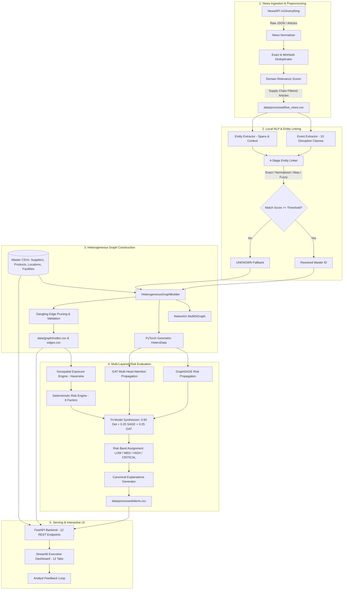

# BDS-35 System Architecture

## 1. Overview & Architectural Blueprint

The **BDS-35 News-to-Risk Early Warning System** is an end-to-end operational prototype designed to ingest unstructured live news broadcasts, extract supply chain disruption signals, resolve affected entities against enterprise master data, project disruptions across a heterogeneous supply chain graph, and compute multi-layered, explainable risk scores using deterministic heuristics and Graph Neural Networks (GraphSAGE and Graph Attention Networks).

---

## 2. Component Breakdown

### 2.1 News Ingestion & Normalization (`src/news/`, `src/deduplication/`, `src/relevance/`)
- **NewsAPI Integration**: Queries the `/v2/everything` endpoint using query strings, language filters, and time window parameters.
- **Deduplication Engine**: Performs dual-pass duplicate detection using SHA-256 fingerprinting of normalized headlines and Jaccard token overlap similarity.
- **Relevance Filter**: Evaluates articles against a curated dictionary of supply chain disruption keywords (ports, labor strikes, factory fires, tariffs, raw material shortages) to eliminate non-actionable general news.

### 2.2 Local NLP & Entity Linking (`src/nlp/`, `src/linking/`)
- **Event Extraction**: Classifies disruption articles into 10 canonical event categories (`PORT_CONGESTION`, `LABOR_STRIKE`, `FACTORY_SHUTDOWN`, `NATURAL_DISASTER`, `GEOPOLITICAL_CONFLICT`, `FINANCIAL_DISTRESS`, `LOGISTICS_DELAY`, `CYBER_ATTACK`, `REGULATORY_SANCTION`, `RAW_MATERIAL_SHORTAGE`) and calculates baseline severity ($S \in [0.0, 1.0]$).
- **Entity Extraction**: Identifies organizational, geographical, and product mentions alongside surrounding context spans.
- **4-Stage Deterministic Linker**:
  1. *Exact String Match*: Resolves direct canonical name hits (score: 1.00).
  2. *Normalized Match*: Strips punctuation, corporate designators (Inc, LLC, Ltd), and whitespace (score: 0.95).
  3. *Alias Match*: Looks up registered synonyms and corporate trading names (score: 0.90).
  4. *Controlled Fuzzy Match*: RapidFuzz token set ratio with configurable threshold ($\ge 0.85$).
  - *Strict Fallback*: If all stages fail or fall below the threshold, the entity is explicitly assigned `UNKNOWN` to avoid hallucinating suppliers.

### 2.3 Graph Construction & Validation (`src/graph/`)
- **Heterogeneous Graph Schema**:
  - *6 Node Types*: `NEWS`, `EVENT`, `SUPPLIER`, `PRODUCT`, `LOCATION`, `FACILITY`.
  - *7 Edge Types*:
    - `(NEWS, HAS_EVENT, EVENT)`
    - `(EVENT, OCCURRED_AT, LOCATION)`
    - `(LOCATION, AFFECTS, FACILITY)`
    - `(FACILITY, BELONGS_TO, SUPPLIER)`
    - `(SUPPLIER, SUPPLIES, PRODUCT)`
    - `(SUPPLIER, DEPENDS_ON, SUPPLIER)`
    - `(PRODUCT, PART_OF, PRODUCT)`
- **Validation & Pruning**: Enforces referential integrity by validating all source and target node IDs. Orphaned edges and invalid endpoints are deterministically removed prior to serialization.
- **Dual Representation**: Maintains a `networkx.MultiDiGraph` for topological analysis, ego-network extraction, and shortest path explainability, alongside a `torch_geometric.data.HeteroData` structure for GPU/CPU tensor computations.

### 2.4 Geospatial Exposure Engine (`src/risk/geo_exposure.py`)
- Computes great-circle distances using the Haversine formula between the geocoded location of an event and all operating facilities of linked suppliers.
- Categorizes exposure into 4 calibrated zones:
  - **Zone 1 (Direct Impact)**: $0 \le d \le 25$ km ($\text{Score} = 1.00$)
  - **Zone 2 (Near Impact)**: $25 < d \le 100$ km ($\text{Score} = 0.70$)
  - **Zone 3 (Regional Exposure)**: $100 < d \le 250$ km ($\text{Score} = 0.40$)
  - **Zone 4 (Distant / Low Exposure)**: $d > 250$ km ($\text{Score} = 0.10$)

### 2.5 Multi-Model Risk Computation (`src/risk/`, `src/gnn/`, `src/alerts/`)
1. **Deterministic Heuristic Engine**: Computes a transparent, weighted risk metric from 6 factors: Event Severity (0.25), Geo Exposure (0.20), Supplier Criticality (0.15), Product Criticality (0.15), Dependency Strength (0.15), and Single Source Penalty (0.10).
2. **GraphSAGE Propagation**: Uses inductive neighbor feature aggregation (`SAGEConv`) to model how disruption shocks diffuse upstream and downstream through multi-tier supplier dependencies.
3. **Graph Attention Network (GAT)**: Employs multi-head self-attention (`GATConv`) to weigh the relative importance of neighboring suppliers dynamically.
4. **Tri-Model Synthesis**:
   $$\text{Combined Risk} = 0.50 \cdot \text{Deterministic} + 0.25 \cdot \text{GraphSAGE} + 0.25 \cdot \text{GAT}$$
   - Maps continuous risk to operational bands: `LOW` ($<0.40$), `MEDIUM` ($0.40-0.60$), `HIGH` ($0.60-0.75$), `CRITICAL` ($\ge 0.75$).

### 2.6 Serving & Presentation (`src/api/`, `dashboard/`)
- **FastAPI REST API**: Serves 12 endpoints covering live ingestion, batch pipeline execution, entity querying, graph analytics, risk profiling, and human-in-the-loop analyst feedback.
- **Streamlit Executive Dashboard**: Provides a responsive, 12-page portal featuring interactive Plotly supply chain graphs, alert triage workflows, geographic heatmaps, and data provenance disclosures.
