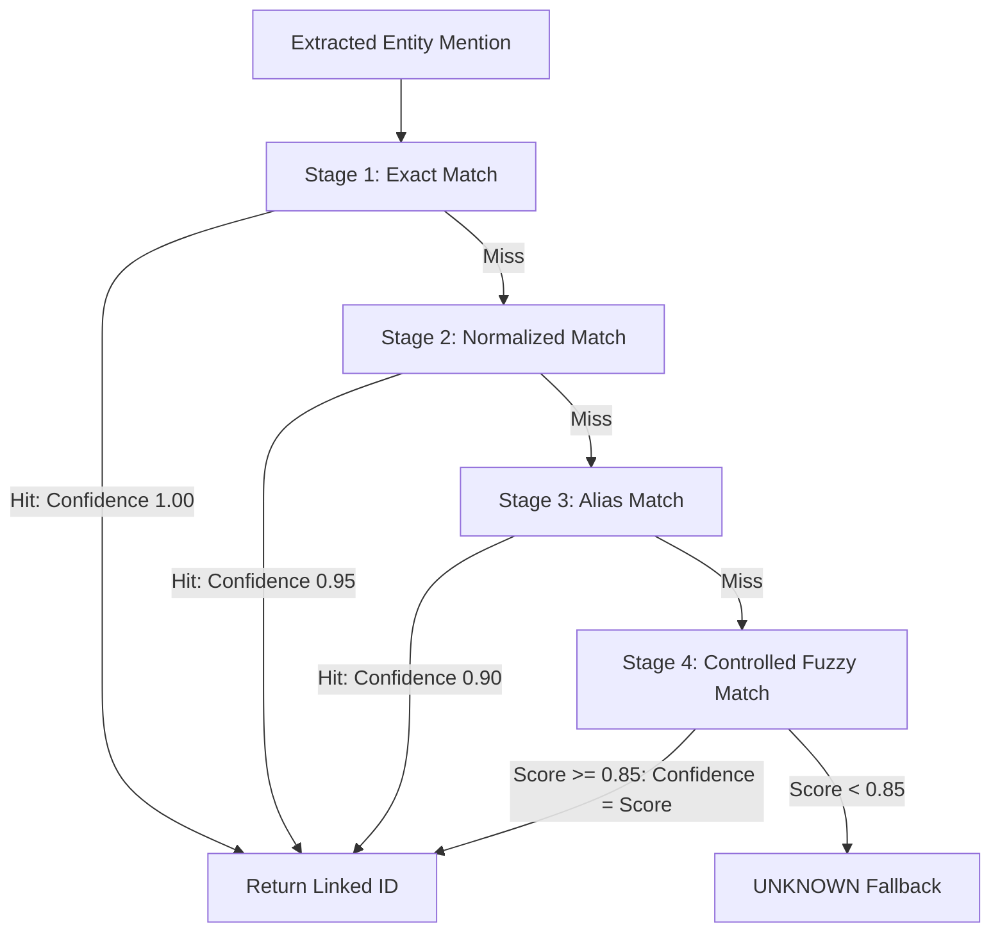

# BDS-35 System Methodology

## 1. End-to-End Pipeline Overview

The BDS-35 methodology implements a deterministic, multi-stage pipeline designed to transform unstructured live global news streams into structured, explainable, and multi-hop supply chain early warning alerts.

The pipeline comprises 8 sequential processing stages:
1. **Live News Ingestion & Normalization**
2. **Dual-Pass Deduplication**
3. **Domain Relevance Filtering**
4. **Local NLP Event & Entity Extraction**
5. **4-Stage Master Data Entity Linking**
6. **Heterogeneous Graph Construction & Validation**
7. **Geospatial Exposure Modeling**
8. **Explainable Risk Synthesis & Alert Generation**

---

## 2. Ingestion, Normalization & Deduplication

### 2.1 News Ingestion
Live articles are fetched via the NewsAPI `/v2/everything` endpoint using boolean topic queries targeting supply chain bottlenecks, port disruptions, strikes, and manufacturing crises. Fetched JSON payloads are sanitized into structured dictionaries:
- Whitespace and HTML tags are stripped.
- Timestamps are coerced into ISO 8601 UTC strings.
- Content is truncated or stitched cleanly between title, description, and article bodies.

### 2.2 Deduplication Strategy
News syndication frequently duplicates stories across multiple wire services. BDS-35 applies a two-tier deduplication algorithm:
1. **Exact Hash Deduplication**: A SHA-256 fingerprint is calculated over the lowercased, punctuation-stripped title string. Duplicates are immediately rejected ($O(1)$ lookup).
2. **Token Jaccard / Overlap Deduplication**: For articles with distinct titles covering the same event, token sets are compared using Jaccard similarity:
   $$J(A, B) = \frac{|T_A \cap T_B|}{|T_A \cup T_B|}$$
   Articles with $J(A, B) \ge 0.80$ within a 48-hour rolling window are consolidated.

### 2.3 Domain Relevance Detection
To prevent general political or consumer news from triggering false alarms, articles must satisfy a keyword-density threshold:
- Articles are scored against a curated dictionary of 150+ supply chain disruption terms across categories (maritime, rail, aviation, labor, raw materials, manufacturing, natural hazards).
- Normalized relevance score $R \in [0.0, 1.0]$ is evaluated against a minimum relevance cutoff ($R \ge 0.20$). Articles below the threshold are discarded prior to expensive NLP inference.

---

## 3. Local NLP Extraction Engine

To satisfy complete offline reproducibility and zero dependency on cloud LLMs (OpenAI/Gemini), BDS-35 utilizes a 100% local, deterministic NLP engine combining spaCy tokenization, dependency parsing, and curated domain pattern matchers.

### 3.1 10-Class Event Extraction
Articles are classified into one of 10 canonical disruption types:
1. `PORT_CONGESTION` (Vessel dwell times, container backlogs, berth delays)
2. `LABOR_STRIKE` (Union walkouts, picketing, collective bargaining standoffs)
3. `FACTORY_SHUTDOWN` (Industrial fires, plant maintenance halt, structural failures)
4. `NATURAL_DISASTER` (Typhoons, earthquakes, river floods, severe winter freezes)
5. `GEOPOLITICAL_CONFLICT` (Cross-border skirmishes, airspace closures, maritime blockades)
6. `FINANCIAL_DISTRESS` (Insolvency filings, supplier debt defaults, bankruptcy restructuring)
7. `LOGISTICS_DELAY` (Freight rail derailments, customs clearance outages, highway blockades)
8. `CYBER_ATTACK` (Ransomware lockouts, terminal operating system failures)
9. `REGULATORY_SANCTION` (Export controls, entity list additions, tariff hikes)
10. `RAW_MATERIAL_SHORTAGE` (Silicon ingot rationing, rare earth quotas, resin deficits)

**Severity Estimation ($S_e$)**:
Event severity is computed from lexical intensifiers (e.g., "halted", "destroyed", "catastrophic", "indefinite") and magnitude modifiers (duration, worker counts, vessel counts), normalized to $[0.1, 1.0]$.

### 3.2 Entity Mention Extraction
Entities representing corporate actors (`ORG`), geographic locations (`GPE`, `LOC`), and manufactured goods are isolated with exact character offsets and surrounding context sentences.

---

## 4. 4-Stage Deterministic Entity Linking

Extracted entity mentions are resolved against master data entities (`data/master/`) through a calibrated 4-stage cascade. If all stages fail to meet confidence thresholds, the entity is explicitly tagged as `UNKNOWN`. New suppliers are **never** fabricated.

1. **Stage 1 (Exact Match)**: Case-insensitive direct comparison against legal entity names in master tables (Confidence = 1.00).
2. **Stage 2 (Normalized Match)**: Text normalization removing common corporate suffixes (`Inc.`, `LLC`, `GmbH`, `Co., Ltd.`), punctuation, and extra whitespace (Confidence = 0.95).
3. **Stage 3 (Alias Match)**: Lookup against registered trade names, acronyms, and historical aliases (Confidence = 0.90).
4. **Stage 4 (Controlled Fuzzy Match)**: Token set ratio metric computed via `rapidfuzz`. Matches are only accepted if similarity $\ge 85\%$ (Confidence = match score).
5. **Strict Fallback**: If match score $< 85\%$, the linker outputs `linked_id = "UNKNOWN"`.

---

## 5. Heterogeneous Graph Construction

The resolved data is mapped to a multi-relational supply chain graph using NetworkX and PyTorch Geometric.

### Graph Schema
- **Nodes**:
  - `NEWS`: Ingested articles.
  - `EVENT`: Extracted disruption events.
  - `SUPPLIER`: Tier-1 and sub-tier suppliers.
  - `PRODUCT`: Sourced assemblies and raw materials.
  - `LOCATION`: Geocoded cities and ports.
  - `FACILITY`: Physical supplier plants.
- **Edges**:
  - `(NEWS) -[HAS_EVENT]-> (EVENT)`
  - `(EVENT) -[OCCURRED_AT]-> (LOCATION)`
  - `(LOCATION) -[AFFECTS]-> (FACILITY)`
  - `(FACILITY) -[BELONGS_TO]-> (SUPPLIER)`
  - `(SUPPLIER) -[SUPPLIES]-> (PRODUCT)`
  - `(SUPPLIER) -[DEPENDS_ON]-> (SUPPLIER)`
  - `(PRODUCT) -[PART_OF]-> (PRODUCT)`

### Integrity Enforcement
Prior to running GNN inference or NetworkX metric calculation:
1. All node IDs are verified against registered primary keys.
2. Dangling edge references (edges pointing to unlinked or pruned nodes) are excised.
3. Edge weights ($w \in (0, 1]$) representing dependency shares or proximity decay are validated.
